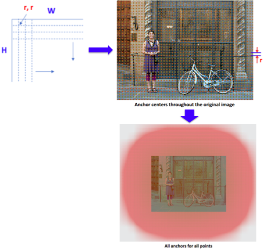
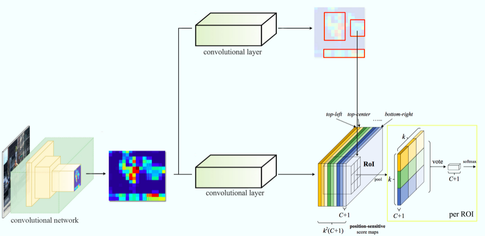

# Object Detection

## Basics

### Region Proposals

#### Invariance Types

#### Selective Search Algorithm 

- It is a clustering based approach which attempts to group pixels and generate proposals based on generated clusters.

Felzenszwalb’s Algorithm - When there exist multiple objects in one image we need to identify a region that potentially contains a target object so that the classification can be performed more efficiently. Felzenszwalb and Huttenlocher (2004) proposed an algorithm for segmenting an image into similar regions using a graph-based approach. It is also the initialization method for *Selective Search*.

**Region proposal generation trade-off:** The more regions you generate, the more likely you will be able to find the object. however, if you exhaustively generate all possible proposals, it will not be possible to run object detector in real-time.

--

#### Localize Objects using Regression

Model is trained with an image and a ground truth bounding box to minimize loss ($\ell^2$ or Euclidean distance between the predicted bounding box and the ground truth) 

--

### Non-Max Supression

- The general idea of non-max supression is to reduce the number of detections in a frame to the actual number of objects present. If the object in the frame is fairly large and more than 2000 object proposals have been generated, it is quite likely that some of these will have significant overlap with each other and the object.
- NMS is an important step and might need hyperparameter tuning

--

### Evaluation Metric

**Mean Average Precision (mAP)** - Most common evaluation metric that is used in objection recognition tasks. It is a number between $0$ and $100$ (higher values are typically better). 

Each bounding box will have a score (likelyhood of the box containing an object). Based on the predictions a precision-recall (PR) curve is computed for each class by varying the score threshold. The average precision (AP) is the area under the PR curve. First the AP is computed for each class, and then averaged over the different classes to get the mAP. Note that a detection is true positive if it has an IoU with ground truth box greater than some threshold $t$.

- Combine all detections from all test images to draw a PR curve for each class. The AP is the area under the PR curve.
- Given that target objects are in different classes, we first compute AP separately for each class, and then average over classes.
- A detection is a true positive if it has IoU with a ground-truth box greater than some threshold $t$ (usually $0.5$, if so the metric is `mAP@0.5`)

### Hard Negative Mining

When training a model for object detection there is often a very large number of negative examples (a single image can yield thousands of negative examples). This makes it infeasible to consider all negative examples. Instead, it is common to construct training data consisting of the positive instances and **hard negative** instances.

Bootstrapping methods train a model with an initial subset of negative examples, and then collect negative examples that are incorrectly classified as positive by this initial model to form a set of hard negatives. A new model is trained with the hard negative examples and the process may be repeated a few times.

## Research Papers

### [OverFeat](https://pdfs.semanticscholar.org/f2c2/fbc35d0541571f54790851de9fcd1adde085.pdf)

#### Idea
OverFeat model integrated object detection, localization and classification tasks into one CNN. The main idea is to do (i) Image classification at different locations on regions of multiple scales of the image in a sliding window fashion, and (ii) Predict the bounding box locations with a regressor trained on top of the same convolution layers

#### Workflow

- Training Stages
	- Train a CNN model on the image classification task
	- Then replace top classifier layers by a regression network and train it to predict object bounding boxes at each spatial location and scale. The regressor is class-specific, each generated for one image class.
		- Input: Images with classification and bounding box
		- Output: Coordinates of bounding box edges ($x_{left}$, $x_{right}$, $y_{top}$, $y_{bottom}$)
		- Loss: The regressor is trained to minimize $\ell^2$ norm between predicted bounding box and the ground truth bounding box for each training example.

- Detection Stage
	- Perform classification at each location using the pretrained CNN model.
	- Predict bounding boxes on all classified regions generated by the classifier.
	- Merge bounding boxes with sufficient overlap from localization and sufficient confidence of being the same object from the classifier.

##### Sliding Window

--

### [R-CNN (Region Based Convolutional Neural Networks)](https://arxiv.org/pdf/1311.2524.pdf)

#### Idea

The main idea is composed of three steps:

- It uses selective search to identify a number of bounding box object region candidates (*Region of Interest* or *RoI*)
- Then, it extracts CNN features from each region independently for classification
- It then classifies each region with SVMs

#### Workflow

- Pre-train a CNN network on image classification task. The classification task involves $k$ classes
- Propose category independent regions of interest by selective search (~2000 region candidates per image). These regions may contain target objects and the regions are of different sizes.
- Region candidates are warped (resized) to have a fixed size that matches CNN input, then save to disk. 
- Continue fine-tuning the CNN on warped proposal regions for $k + 1$ classes. The additional one class refers to the background (no object of interest). In the fine-tuning stage, *use a much smaller learning rate* and the *mini-batch oversamples the positive cases* because most proposed regions are just background.
- For each image region, one forward propagation through CNN generates a feature vector. This feature vector is then used to train binary SVM classifier for each class independently. 
- To reduce localization errors, a regression model is trained to correct the predicted detection window on bounding box correction offset using CNN features. 

#### Limitations

R-CNN is expensive and slow as the following process are expensive

- Running selective search to propose 2000 region candidates for each image in $N$ images
- Generating CNN feature vector for every image region ($N \times 2000$)
- Workflow involves 3 models separately without shared computation
	- CNN for image classification and feature extraction
	- SVM classifier to identifying target objects
	- Regression model for correcting region bounding boxes 
- Slow at test time as need to run full forward pass of CNN for each region proposal
- Complex multistage training pipeline

#### Preprocessing and Other Details

--

### [Fast R-CNN](https://arxiv.org/pdf/1504.08083.pdf)

#### Idea

Combine 3 (CNN, SVM, Regression) independent models into one jointly trained framework and increase shared computation to make R-CNN faster.

Instead of extracting CNN feature vectors independently for each region proposal, Fast R-CNN aggregates them into feature matrix using CNN forward pass over the entire image and the region proposals share this feature matrix (RoI feature vector). The RoI feature vector is branched out to be used for learning the object classifier and the bounding box regressor - This **computation sharing speeds up R-CNN**

##### RoI Pooling

Fast R-CNN receives region proposals from external system (Selective Search). The region proposals are sent to *RoI Pooling* layer that will resize all regions with their data to a fixed size. RoI pooling is necessary because the *Fully Connected* layer expects that all the vectors will have same size.

RoI pooling is a type of max-pooling where region proposals are projected onto CONV feature maps of size $H \times W$ and then projected region is divided into $h \times w$ grid and then max-pooling is applied in each grid.

**RoI Example**

- Input image: 

- 2 proposed regions

- Activations on the last CONV layer - For each convolution activation the RoI pooling layer will resize the region proposals to the same resolution expected on the FC layer

- RoI projected onto CONV feature map

- Output RoI features

#### Workflow

- Pre-train a CNN network on image classification task. The classification task involves $k$ classes
- Propose category independent regions of interest by selective search (~2000 region candidates per image)
- Modify the pre-trained CNN:
	- Replace the last max-pooling layer of the pre-trained CNN with a *RoI Pooling* layer. The RoI pooling layer outputs fixed length feature vectors of region proposals.
	- Replace the last FC layer and the last softmax layer ($k$ classes) with a FC layer and a softmax over $k + 1$ classes
	- The RoI feature vector branches out to a bounding box regression model which predicts offsets relative to original RoI for each of $k$ classes.

#### Limitations

Fast R-CNN is much faster in both training and testing. Since the region proposals are generated separately by another model, which is an expensive step, the improvements are not that significant (Test time per image with Selective Search is around 2 seconds)

#### Preprocessing and Other Details

##### Loss

The model is optimized for a loss combining classification and regression losses.

- $u$ - True class label, $u \in 0, 1, ..., k$. The background class has $u=0$
- $p$ - Discrete probability distribution (per RoI) over $k+1$ classes: $p=(p_0, p_1, ..., p_k)$ computed by a softmax over $k+1$ outputs of a FC layer
- $v$ - Ground truth bounding box, $v = (v_x, v_y, v_w, v_h)$
- $t^u$ - Predicted bounding box offsets, $t^u = (t_x^u, v_y^u, v_w^u, v_h^u)$
- $\lambda$ - Hyper-parameter to control the balance between two task losses ($\lambda=1$ used)

Multi-task loss sums up the classification loss and regression loss as $\ell = \ell_{class} + \ell_{bbox}$. For "background" RoI, $\ell_{bbox}$ is ignored by the indicator function $\mathbb{1}[u\geq1]$, which is defined as:

$$\mathbb{1}[u\geq1] = \begin{cases} 
      1 & \text{if } u\geq 1 \\
      0 & otherwise 
   \end{cases}$$
The multi-task loss is:

$$\ell(p, u, t^u, v) = \ell_{class}(p, u) + \lambda \mathbb{1}[u\geq1]\ell_{bbox}(t^u, v)$$

$$\ell_{class}(p, u) = - \text{log } p_u$$

$$\ell_{bbox}(t^u, v) = \sum_{i \in \{x, y, w, h\}} L_1^{smooth}(t_i^u-v_i)$$

Smooth $L_1$ loss is a robust $L_1$ loss as it is less sensitive to outliers than the $L_2$ loss used in R-CNN

$$L_1^{smooth} = \begin{cases} 
      0.5x^2 & \text{if } |x| < 1 \\
      |x| - 0.5 & otherwise 
   \end{cases}$$

--

### [Faster R-CNN](https://arxiv.org/pdf/1506.01497.pdf)

#### Idea

Integrate the region proposal algorithm into the CNN model. Faster R-CNN is a unified model composed of **Region Proposal Network (RPN)** and **Fast R-CNN** with shared convolutional feature layers.

- RPN is inserted after the last CONV layer. RPN is trained to produce region proposals directly - No need for external region proposals
- RPN returns a set of bounding boxes based on CNN layer

**4 Losses**

- **RPN Classification** - Object or not an Object
- **RPN Regression** - Bounding box proposal
- **Fast R-CNN Classification** - Object classification
- **Fast R-CNN Regression** - Improve bounding box proposal

##### Region Proposal Network (RPN)

- RPN slides a small spatial window $n \times n$ (*position of the sliding window provides localization information with reference to the image*) over the last CONV layer feature map of the image to produce a lower-dimensional feature. This feature is fed into 2 sibling FC layers:
	- *Bounding Box Clasification Layer (cls)* - Classify what is under the spatial window as an object or not an object
	- *Bounding Box Regression Layer (reg)* - It provides finer localization information with reference to sliding window
- At each sliding window location RPN predicts multiple region proposals based on $k$ fixed-ratio *anchor boxes* (default bounding boxes), 
- The number of maximum possible proposals for each sliding window location is $k$ (*reg* layer has $4k$ outputs encoding coordinates of $k$ boxes and *cls* layer outputs $2k$ scores that estimate the probability of object or not object for each proposal). The $k$ proposals are parameterized relative to $k$ reference boxes (called anchors).
	- Anchor is centered at the sliding window and it is associated with a scale and aspect ratio (paper uses 3 scales and 3 aspect ratios, yielding $k=9$ anchors at each sliding position 
	- Anchors are **translation invariant**

> In simple words RPN looks at each location in the last CONV layer feature map and considers $k$ different boxes (tall box, wide box, big box, etc.) centered around it. For each of those boxes it outputs whether the box contains an object or not, and the coordinates of the box.

#### Workflow

- Pre-train a CNN network on image classification task. 
- Fine-tune the RPN end-to-end for the region proposal task (RPN is initialized by the pre-trained classifier). Positive samples have $IoU > 0.7$, while negative samples have $IoU < 0.3$
- Train a Fast R-CNN object detection model using proposals generated by the current RPN
- Use Fast R-CNN to initialize RPN training. While keeping the shared CONV layers, fine-tune only the RPN specific layers
- Finally fine-tune the unique layers of Fast R-CNN

#### Limitations

- Complex pipeline
- Uses alternating optimization to train RPN, then Fast R-CNN with proposals (Can use joint training since there are 4 losses)

#### Preprocessing and Other Details

##### Loss

The model is optimized for a multi-task loss function.

- $p_i$ - Predicted probability of anchor $i$ being an object
- $p_i^*$ - Ground truth label of whether anchor $i$ is an object
- $t_i$ - Predicted coordinates
- $t_i^*$ - Ground truth coordinates
- $N_{cls}$ - Normalization term, set as mini-batch size in the paper
- $N_{box}$ - Normalization term, set as number of anchor locations (~2400) in the paper
- $\lambda$ - A balancing parameter ($\lambda = 10$ used in paper so that $\ell_{cls}$ and $\ell_{box}$ terms are roughly equally weighted)

Multi-task loss for RPN sums up the classification loss and regression loss as $\ell = \ell_{cls} + \ell_{box}$. 

The multi-task loss is:

$$\ell(\{p_i\}, \{t_i\}) = \frac{1}{N_{cls}}\sum_i\ell_{cls}(p_i, p_i^*) + \frac{\lambda}{N_{box}} \sum_i p_i^*L^{smooth}_1(t_i - t_i^*)$$

Where $\ell_{cls}$ is the log loss function over two classes.

$$\ell_{cls}(p_i, p_i^*) = - p_i^*\text{log } p_i - (1-p_i^*)\text{log } (1-p_i)$$

#### How RPN works

- Hardest issue with using deep learning for object detection is generating a variable length list of bounding boxes. In the CNN the last feature map is usually a fixed sized tensor output.
- RPN solves the variable length problem using anchors (fixed sized reference bounding boxes which are placed uniformly throughout the original image). For every anchor, we ask:
	- Does this anchor contain a relevant object?
	- How would we adjust this anchor to better fit the relevant object?

##### Anchors

Objective is to find bounding boxes in the image. Bounding boxes can be of differet sizes and aspect ratios. Approach to predicting bounding boxs: **Learn to predict offsets from reference boxes**  

- Take a reference bounding box: $x_{center}$, $y_{center}$, $width$, $height$
- Learn to predict offsets $\Delta_{x_{center}}$, $\Delta_{y_{center}}$, $\Delta_{width}$, $\Delta_{height}$ from reference boxes. Offsets are small values that tweak the reference box to better fit the object

*Anchors* are fixed bounding boxes with different sizes and aspect rations. They are placed throughout the image and are going to be used for reference when predicting object locations. 

Convolutional feature map has size $f_w \times f_h \times f_c$, create a set of anchors for each of the points in $f_w \times f_h$. *NOTE: Even though anchors are defined based on the convolutional feature map, the final anchors reference the original image*

Since only convolutional and pooling layers are used to generate feature map, the dimension of feature map will be proportional to dimensions of the original image. If the original image is of size $x \times h$, the generated feature map will end up with size $w/r \times h/r$ where $r$ is called *subsampling ratio*. If we define one anchor per spatial position of the feature map, the final image will end up with a bunch of anchors separated by $r$ pixels.

##### Region Proposal Network

RPN takes all the reference boxes (anchors) and outputs a set of good proposals for objects. Each anchor will generate 2 different outputs:

- Proability (objectness score) that an anchor is an object or background (RPN does not care what class of object it is). This objectness score is used to filter out bad predictions for second stage
- Bounding box regression for adjusting the anchors to better fit the object it is predicting

RPN is implemented in a fully convolutional way. It uses the convolutional feature map returned by the base network (VGG or ResNet, etc.) as input. First a CONV layer with $d$ channels and $p \times p$ kernel size is used, then 2 parallel convolution layers (classification and regression) with **number of channels depending of number of anchors per point** and $1 \times 1$ kernel size is used.

- Classification layer outputs 2 predictions per anchor (score of it being background and the score of it being object)
- Regression or bounding box adjustment layer outputs 4 predictions per anchor: $\Delta_{x_{center}}$, $\Delta_{y_{center}}$, $\Delta_{width}$, $\Delta_{height}$, which will be applied to the anchors to get the final proposals.

**RPN Training** 

- Take all the anchors and put them into 2 different categories:
	- Anchors that overlap a ground truth object with $IoU \gt 0.5$ are considered as **foreground (positive)** and those that do not overlap any ground truth object or have $IoU \lt 0.1$ with ground truth objects are considered as **background (negative)** 
- Randomly sample these anchors to form a mini-batch of size $s$ (try to maintain a balanced ratio between positive and negative anchors)
- RPN uses all the anchors selected for the mini-batch to calculate classification loss
- RPN then uses only those mini-batch anchors marked as **foreground** to calculate regression loss. For calculating targets for regression foreground anchor and closest ground truth bounding box is used. Then $\Delta$ is calculated to transform the anchor into the object.
- Non-maximum supression is used to post-process proposals as they overlab because anchors overlap.

**RoI Pooling**

- Faster R-CNN reuses the existing convolutional feature map. It extracts fixed-sized feature maps for each proposal using RoI pooling. Fixed size feature maps are needed for the R-CNN in order to classify them into a fixed number of classes.
- Convolution feature map is cropped using each proposal and then each crop is resized to a fixed sized feature map using interpolation (usually binary). After cropping, max pooling with a $2 \times 2$ kernel is used to get a final feature map for each proposal.

#### RPN Example

**Anchor Generation**

- First generate $k$ anchors of different scales and aspect ratios.

- Since only convolutional and pooling layers are used in the base network to generate feature map of the input image, the dimension of feature map will be proportional to dimensions of the input image. 
	- Input image size: $W \times H \times C$
	- Feature map size: $w \times h \times d$ 
	- The generated feature map will end up with size $W/r \times H/r$ where $r$ is called *subsampling ratio*.

- The generated $k$ anchors are replicated by translating them throughout uniformly spaced grid points spanning the input image. The anchors that cross image boundry $W \times H$ are ignored.

- The feature maps produced by the head network (e.g. VGG) are passed through a $k \times k$ convolutional layer. The output of $k \times k$ convolutional layer is passed through 2 $1 \times 1$ convolutional layer to produce *foreground/background* class scores and corresponding bounding box coordinates.

##### Implementations
- [TensorFlow]() - NOTE: Tensorflow implementation of Faster R-CNN with Inception ResNet is the slowest but most accurate model
- [PyTorch](https://github.com/longcw/faster_rcnn_pytorch)

--

### [Mask R-CNN](https://arxiv.org/pdf/1703.06870.pdf)

#### Idea

Mask R-CNN extends Faster R-CNN to pixel-level **image segmentation**. It adds a third branch to framework of Faster R-CNN for predicting object mask in parallel with the existing branches for classification and localization. The **mask branch is a small Fully Convolutional Network** applied to each RoI for predicting a segmentation mask in a pixel-to-pixel manner.

Pixel-level segmentation requires more fine-grained alignment than bounding box. Mask R-CNN improves *RoI pooling layer* (re-named as **RoIAlign layer**) so that RoI can be more precisely mapped to the regions of the original image.

##### RoIAlign Layer

*RoIAlign layer* is designed to fix the location misalignment caused by quantization in the RoI pooling. In Faster R-CNN region proposals are used to crop feature maps. Feature maps are usually much smaller than the input image. To project an RoI on to feature maps the ratio between input size and feature map size is used to find corresponding RoI locations on feature map. Usually the found RoI locations are real numbers, which are converted to integers (first quantization). Then RoI pooling layers will quantize it again through max-pooling (second quantization) to make it fit into a fixed size region. These **coarse spatial quantizations create misalignments** between the RoI and the extracted features.

RoIAlign layer solves these misalignments by keeping calculated locations as real numbers after *region proposal projection*. RoIAlign then divides the projected region into *bins*. For each bin RoIAlign uses **bilinear interpolation** from the nearby points on the feature map to create 4 sampling points. Then RoIAlign aggregates (max or average) the value of those 4 points in each bin, this finishes pooling operation.

**RoIAlign Example**

- Input image size: $128 \times 128$
- RoI size: $15 \times 15$
- Feature map size: $25 \times 25$

Each pixel in the input image corresponds to $\sim 25/128$ pixels in the feature map. Features corresponding to $15 \times 15$ RoI in the input image can be selected from feature map using $\sim 25/128$ ratio. To select features corresponding to $15$ pixels in input image, select $15 * 25/128 \approx 2.93$ pixels from feature map. 

*In RoI pooling $2.93$ pixels would be rounded down to $2$ pixels and this causes misalignment.* **In RoIAlign rounding down is avoided and instead bilinear interpolation is used to select feature at pixel 2.93**.

#### Workflow

- Same as Faster R-CNN

#### Preprocessing and Other Details

##### Loss

The model is optimized for a multi-task loss function. Multi-task loss sums up the classification loss, regression loss and segmentation loss as $\ell = \ell_{cls} + \ell_{box} + \ell_{mask}$, where $\ell_{cls}$ and $\ell_{box}$ are same as in Faster R-CNN.

The mask branch generates a mask of dimension $m \times m$ for each RoI and each class ($K$ classes in total), thus output size is $K \cdot m^2$. 

$\ell_{mask}$ is defined as the average binary cross-entropy loss:

$$\ell_{mask} = \frac{1}{m^2}\sum_{1 \leq i, j \leq m} [y_{ij}log\widehat{y}^{k}_{ij} + (1-y_{ij})log(1-\widehat{y}^{k}_{ij})]$$

where $y_{ij}$ is the label of cell $(i, j)$ in the true mask for the region of size $m \times m$ and $\widehat{y}^{k}_{ij}$ is the predicted value of the same cell in the mask learned for the ground-truth class $k$

##### Implementations
- [TensorFlow](https://github.com/CharlesShang/FastMaskRCNN)
- [PyTorch](https://github.com/felixgwu/mask_rcnn_pytorch)

--

### R-CNN Family

### Bounding Box Regression (R-CNN)

The bounding box regression relies on image features computed by the CNN for region proposals. 

- $P$ - Proposal 
- $G$ - Ground truth 
- $\widehat{G}$ - Predicted ground truth

Training a model for bounding box regression attempts to **learn a transformation that maps a proposed box $P$ to the ground truth box $G$**.

- Input to training algorithm is a set of $N$ training pairs $\{{P^i, G^i}\}_{i=1, 2, ..., N}$ where 
	- $P_i = (P_x^i, P_y^i, P_w^i, P_h^i)$, where $P_x^i, P_y^i$ specifies the pixel coordinates of the center of proposal $P^i$'s bounding box, $P_w^i$ and $P_h^i$ specifies width and height of proposal $P^i$'s bounding box
	- $G_i = (G_x^i, G_y^i, G_w^i, G_h^i)$, where $G_x^i, G_y^i$ specifies the pixel coordinates of the center of ground truth $G^i$'s bounding box, $G_w^i$ and $G_h^i$ specifies width and height of ground truth $G^i$'s bounding box

Transformation is parameterized in terms of 4 functions: $d_x(P)$, $d_y(P)$, $d_w(P)$, and $d_h(P)$

- $d_x(P)$ and $d_y(P)$ specify a scale-invariant translation of the center of proposal $P$'s bounding box. 
- $d_w(P)$, and $d_h(P)$ specify *log-space* translation of the width and height of proposal $P$'s bounding box

After learning these 4 functions, the input proposal $P$ can be transformed into a predicted ground-truth bounding box $\widehat{G}$  by applying transformation functions:

$$\widehat{G}_x = P_wd_x(P) + P_x \tag{1}$$ 
$$\widehat{G}_y = P_hd_y(P) + P_y \tag{2}$$
$$\widehat{G}_w = P_wexp(d_w(P)) \tag{3}$$
$$\widehat{G}_h = P_hexp(d_h(P)) \tag{4}$$

In equations 1 and 2, $d_x(P)$ and $d_y(P)$ learn an adjustment factor which is then multiplied by proposal's width and height respectively. $d_w(P)$, and $d_h(P)$ are log-space translations of width and height - this produces better results on the wide range of bounding box dimensions. 

Each function $d_*(P)$ is modeled as a linear function of CNN features of proposal $P$, denoted by $\phi_{layer}(P)$, i.e. $\phi_{layer}(P)$ is the feature vector for proposal $P$. Thus $d_*(P) = \mathbf{w}_*^T\phi_{layer}(P)$, where $\mathbf{w}_*$ is a vector of learnable model parameters. NOTE: $*$ is one of ($x$, $y$, $h$, $w$)

Learn $\mathbf{w}_*$ by optimizing the regularized least squares objective (ridge regression):

$$\mathbf{w}_* = \underset{\widehat{\mathbf{w}}_*}{\operatorname{argmin}}\sum_i^N (t_*^i - \widehat{\mathbf{w}}_*^T\phi_{layer}(P^i))^2+\lambda||\widehat{\mathbf{w}}_*||^2$$

Where, the regression $t_*$ for the training pair $(P, G)$ are defined as:

$$t_x = (G_x - P_x)/P_w \tag{5}$$
$$t_x = (G_y - P_y)/P_h \tag{6}$$
$$t_w = log(G_w/P_w) \tag{7}$$
$$t_h = log(G_h/P_h) \tag{8}$$

#### Bounding Box Regression Example

- Input image with ground truth bounding box $G$

- A region proposal $P$ generated by selective search

- Forward pass of warped region proposal $(P)$ through a pre-trained CNN generates feature map of region proposal denoted as $\phi_{layer}(P)$. The feature map is reshaped to a vector.

- Using equations 5, 6, 7 and 8, calculate regression targets $t_*$ for training pair $(P, G)$
	- $t_x = (135.5 - 132.5)/210.5 = 0.014$
	- $t_y = (145.5 - 148.5)/231.5 = 0.013$
	- $t_w = log_e(237.5/210.5) = 0.12$
	- $t_h = log_e(240.5/231.5) = 0.04$

- Bounding box regression attempts to learn a transformation that maps a proposed box $P$ to the ground truth box $G$. Transformation is parameterized in terms of 4 functions: $d_x(P)$, $d_y(P)$, $d_w(P)$, and $d_h(P)$. Each function $d_*(P)$ is modeled as a linear function of CNN features of proposal $P$, denoted by $\phi_{layer}(P)$
	- $d_x(P) = \mathbf{w}_x^T\phi_{layer}(P)$, where $\mathbf{w}_x$ is a vector of learnable model parameters
	- $d_y(P) = \mathbf{w}_y^T\phi_{layer}(P)$, where $\mathbf{w}_y$ is a vector of learnable model parameters
	- $d_w(P) = \mathbf{w}_w^T\phi_{layer}(P)$, where $\mathbf{w}_w$ is a vector of learnable model parameters
	- $d_h(P) = \mathbf{w}_h^T\phi_{layer}(P)$, where $\mathbf{w}_h$ is a vector of learnable model parameters

- For all proposals $P^i$, learnable parameters $\mathbf{w}_x$, $\mathbf{w}_y$, $\mathbf{w}_w$ and $\mathbf{w}_h$ are learned by optimizing the following regularized least squares objectives:

$$\mathbf{w}_x = \underset{\widehat{\mathbf{w}}_x}{\operatorname{argmin}}\sum_i^N (t_x^i - \widehat{\mathbf{w}}_x^T\phi_{layer}(P^i))^2+\lambda||\widehat{\mathbf{w}}_x||^2$$

$$\mathbf{w}_y = \underset{\widehat{\mathbf{w}}_y}{\operatorname{argmin}}\sum_i^N (t_y^i - \widehat{\mathbf{w}}_y^T\phi_{layer}(P^i))^2+\lambda||\widehat{\mathbf{w}}_y||^2$$

$$\mathbf{w}_w = \underset{\widehat{\mathbf{w}}_w}{\operatorname{argmin}}\sum_i^N (t_w^i - \widehat{\mathbf{w}}_w^T\phi_{layer}(P^i))^2+\lambda||\widehat{\mathbf{w}}_w||^2$$

$$\mathbf{w}_h = \underset{\widehat{\mathbf{w}}_h}{\operatorname{argmin}}\sum_i^N (t_h^i - \widehat{\mathbf{w}}_h^T\phi_{layer}(P^i))^2+\lambda||\widehat{\mathbf{w}}_h||^2$$

- After learning parameters $\mathbf{w}_x$, $\mathbf{w}_y$, $\mathbf{w}_w$ and $\mathbf{w}_h$, the region proposal $P$ can be transformed into predicted ground-truth bounding box $\widehat{G}$ by using the following transformation functions:

  $$\widehat{G}_x = P_w\mathbf{w}_x^T\phi_{layer}(P) + P_x$$

  $$\widehat{G}_y = P_h\mathbf{w}_y^T\phi_{layer}(P) + P_y$$

  $$\widehat{G}_w = P_wexp(\mathbf{w}_w^T\phi_{layer}(P))$$

  $$\widehat{G}_h = P_hexp(\mathbf{w}_h^T\phi_{layer}(P))$$

### Bounding Box Regression (Fast R-CNN)

The process is similar to R-CNN Bounding Box Regression, except that instead of  $L_2$ loss (regularized least square loss, i.e. Ridge regression), smooth $L_1$ loss is used. Smooth $L_1$ loss is a robust $L_1$ loss as it is less sensitive to outliers than the $L_2$ loss used in R-CNN

$$L_1^{smooth} = \begin{cases} 
      0.5x^2 & \text{if } |x| < 1 \\
      |x| - 0.5 & otherwise 
   \end{cases}$$
   
### Bounding Box Regression (Faster R-CNN)

- $G$ - Ground truth 
- $A$ - Anchor
- $\widehat{G}$ - Predicted

- $G = (x^*, y^*, w^*, h^*)$, where $x^*, y^*$ specifies the pixel coordinates of the center of ground truth $G$'s bounding box, $w^*$ and $h^*$ specifies width and height of ground truth $G$'s bounding box
- $A = (x_a, y_a, w_a, h_a)$, where $x_a, y_a$ specifies the pixel coordinates of the center of anchor $A$'s bounding box, $w_a$ and $h_a$ specifies width and height of anchor $A$'s bounding box
- $\widehat{G} = (x, y, w, h)$, where $x, y$ specifies the pixel coordinates of the center of predicted $\widehat{G}$'s bounding box, $w$ and $h$ specifies width and height of predicted $\widehat{G}$'s bounding box

- $t_i$ - Vector representing the 4 parameterized coordinates of the predicted bounding box. The coordinates are parameterized as follows:
	-  $t_x = (x - x_a)/w_a$
	-  $t_y = (y - y_a)/h_a$
	-  $t_w = log(w/w_a)$
	-  $t_h = log(h/h_a)$
- $t_i^*$ - Vector representing the 4 parameterized coordinates of the ground truth bounding box. The coordinates are parameterized as follows:
	-  $t_x^* = (x^* - x_a)/w_a$
	-  $t_y^* = (y^* - y_a)/h_a$
	-  $t_w^* = log(w^*/w_a)$
	-  $t_h^* = log(h^*/h_a)$

$$L_{reg}(t_i, t_i^*) = R(t_i-t_i^*)$$

Where $R$ is smooth $L_1$ loss function.

In **R-CNN** and **Fast R-CNN**, bounding-box regression is performed on features pooled from *arbitrarily* sized RoIs ($P$'s) and the regression weights are *shared* by all region sizes. In **Faster R-CNN** features used for regression are of the same spatial size $3 \times 3$ on the feature maps. To account for varying sizes, a set of $k$ bounding-box regressors are learned (where $k$ is number of anchors). Each regressor is responsible for one scale and aspect ratio, and the $k$ regressors do not share weights. This makes it possible to predict boxes of various sizes even though the features are of a fixed scale/size.

--

### [R-FCN (Region Based Fully Convolutional Network)](https://arxiv.org/pdf/1605.06409.pdf)

#### Idea

Maximize shared computation by using Fully Convolutional Network (FCN) for object detection to improve speed. R-FCN is several times faster than Faster R-CNN and achieves comparable accuracy.

Since model is fully convolutional the computations are shared so there needs a compromise between tranlsation invariance and translation variance. Challenges due to model being fully convolutional:

- **Image classification** favors **translation invariance** - Classifier learns to recognize an object as an object even when its appearance varies in some way, i.e. classifier will recognize the object regardless of where it appears on the image. NOTE: *Translation* means that each pixel in the image has been moved the same amount in same direction. 
- **Object detection** needs localization representations that are **translation variant** - If the object is in the top left corner, detector would create bounding box in top left corner.

##### Solution: Position-Sensitive Score Maps

To incorporate translation variance into FCN a set of Position-Sensitive Score Maps are created by using a bank of specialized convolutional layers as the FCN output. 

The last convolutional layer produces a bank of $k^2$ **position-sensitive score maps** (feature maps) for each category. Each feature map is specialized in the detection of a category at some location, e.g one feature map is specialized in the detection of a dog, another on in the detection of a car, and so on. Each of the feature maps encodes the position information with respect to a relative spatial position, this is why the maps are called *position-sensitive score maps*. All these maps form *score bank*.

- Position-sensitive score map channels: $k^2(C + 1)$, where $C$ is number of categories ($+1$ for background)
- The bank of $k^2$ score maps correspond to a $k \times k$ spatial grid describing relative positions, e.g. with $k \times k = 3 \times 3$, the 9 score maps encode the cases of *{top-left, top-center, top-right, ..., bottom-right}* of an object category.

A Region Proposal Network (RPN) proposes candidate RoIs, which are then applied on the score maps. All learnable weight layers are convolutional and are computed on the entire image; the per-RoI computational cost is negligible.

#### Workflow

- Run a CNN (e.g. ResNet) over the input image
- Add a fully convolutional layer to generate a *score bank*
- Run a fully convolutional RPN to generate RoIs
- For each RoI, divide it into $k^2$ bins as the score maps
- For each bin, check the score bank to see if that bin matches the corresponding position of some object. If the current bin is *top-left* bin, then grab score map corresponding to *top-left* of the object and average those values in the RoI region. This process is repeated for each class.
- Once each of $k^2$ bins has an *object match* value for each class, average the bins to get a single score per class.
- Classify the RoI with a softmax over the remaining $C+1$ dimensional vector

> R-FCN considers each region proposal, divides it up into sub-regions and iterates over the sub-region asking: “does this look like the top-left of a baby?”, “does this look like the top-center of a baby?” “does this look like the top-right of a baby?”, etc. It repeats this for all possible classes. If enough of the sub-regions say “yes, I match up with that part of a baby!”, the RoI gets classified as a baby after a softmax over all the classes.

 
 
 Position-sensitive score maps learned by R-FCN are visualized above. when $k \times k = 3 \times 3$. These specialized maps are expected to be strongly activated at a specific relative position of an object. For example, the “top-center-sensitive” score map exhibits high scores roughly near the top-center position of an object. If a candidate box precisely overlaps with a true object most of the $k^2$ bins in the RoI are strongly activated, and their voting leads to a high score. On the contrary, if a candidate box does not correctly overlaps with a true object, some of the $k^2$ bins in the RoI are not activated, and the voting score is low.

**R-FCN Example**

- Consider a $5 \times 5$ feature map **M** with a square object inside it.
- Divide the square object equally into $3 \times 3$ regions
- Create a new feature map from **M** to detect *top-left (TL)* corner of the square object only. 
- Create new feature maps for other remaining 8 regions *top-right (TR)*, ..., *bottom-right (BR)* similarly. Each feature map will detect corresponding region of the square object. These feature maps are called position-sensitive score maps because each map detects (scores) a sub-region of the object. 
- Consider an RoI proposal (dotted red rectangle) projected onto feature map

- Divide RoI into $3 \times 3$ regions and ask how likely each region contains the corresponding part of the object. Store the results into a $3 \times 3$ vote array. This process of mapping score maps and RoIs to vote array is called *position-sensitive RoI-pool* (explained below) 
	- Take *top-left RoI* and map it to the *top-left score map*. Compute the average score of *top-left score map* bounded by the *top-left RoI* (blue rectangle) - About $40\%$ of the area inside blue rectangle has $0$ activation and $60\%$ has $100%$ activation, i.e. on average $0.6$, so the likelihood that *top-left* of object detected is $0.6$. Store the result in vote array `[0][0]`.
	- Do this process with *top-middle RoI* with *top-middle score map*, store the result in vote array `[0][1]`and so on. 
	- After calculating all the values for *position-sensitive RoI-pool*, the class score is the average of *vote array* elements. 

#### Preprocessing and Other Details

--

### [SSP-net (Spatial Pyramid Pooling)](https://arxiv.org/pdf/1406.4729.pdf)

#### Idea

Running CNN on RoI generated by selective search takes a lot of time. SSP-net computes the feature maps from the entire image only once, and then pool features in arbitrary regions (sub-images) generated by selective search to generate fixed-length representations for training the detectors. 

CNNs require a fixed size input and likely reduces its recognition accuracy for images or sub-images of an arbitrary size/scale. *Spatial pyramid pooling* eliminates fixed size input requirement. SPP-net uses spatial pooling after the last convolutional layer as opposed to traditionally used max-pooling for generating fixed size of input to the fully connected layers of the CNN. SPP layer divides a region of any arbitrary size into a constant number of bins and max pool is performed on each of the bins. Since the number of bins remains the same, a constant size vector is produced. 

#### Limitations

It was not trivial to perform back-propagation through spatial pooling layer. Hence, the network only fine-tuned the fully connected part of the network.

--

